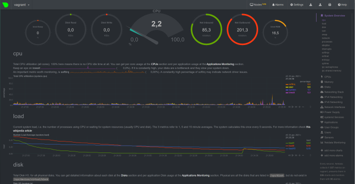

# devops-netology

---

### Домашнее задание к занятию "3.4. Операционные системы, лекция 2"

1. #### На лекции мы познакомились с [node_exporter](https://github.com/prometheus/node_exporter/releases). В демонстрации его исполняемый файл запускался в background. Этого достаточно для демо, но не для настоящей production-системы, где процессы должны находиться под внешним управлением. Используя знания из лекции по systemd, создайте самостоятельно простой [unit-файл](https://www.freedesktop.org/software/systemd/man/systemd.service.html) для node_exporter:

    * поместите его в автозагрузку,
    * предусмотрите возможность добавления опций к запускаемому процессу через внешний файл (посмотрите, например, на `systemctl cat cron`),
    * удостоверьтесь, что с помощью systemctl процесс корректно стартует, завершается, а после перезагрузки автоматически поднимается.

```bash
    $ systemctl cat node-exporter
# /etc/systemd/system/node-exporter.service
[Unit]
Description=Prometheus Node Exporter
Documentation=https://github.com/prometheus/node_exporter
[Service]
Restart=always
User=prometheus
Group=prometheus
EnvironmentFile=/etc/default/node-exporter
ExecStart=/usr/local/bin/node_exporter $OPTIONS
ExecReload=/bin/kill -HUP $MAINPID
TimeoutStopSec=20s
SendSIGKILL=no
[Install]
WantedBy=multi-user.target
    $ cat /etc/default/node-exporter
# Set the command-line arguments to pass to the server.
OPTIONS=""
    $ sudo systemctl enable node-exporter
    Created symlink /etc/systemd/system/multi-user.target.wants/node-exporter.service → /etc/systemd/system/node-exporter.service.
    $ sudo systemctl start node-exporter
    $ sudo systemctl status node-exporter
● node-exporter.service - Prometheus Node Exporter
     Loaded: loaded (/etc/systemd/system/node-exporter.service; enabled; vendor preset: enabled)
     Active: active (running) since Sat 2021-12-04 15:43:47 UTC; 2min 13s ago
       Docs: https://github.com/prometheus/node_exporter
   Main PID: 6582 (node_exporter)
      Tasks: 5 (limit: 1112)
     Memory: 2.5M
     CGroup: /system.slice/node-exporter.service
             └─6582 /usr/local/bin/node_exporter

Dec 04 15:43:47 vagrant node_exporter[6582]: ts=2021-12-04T15:43:47.966Z caller=node_exporter.go:115 level=info collector=thermal_zone
Dec 04 15:43:47 vagrant node_exporter[6582]: ts=2021-12-04T15:43:47.966Z caller=node_exporter.go:115 level=info collector=time
Dec 04 15:43:47 vagrant node_exporter[6582]: ts=2021-12-04T15:43:47.967Z caller=node_exporter.go:115 level=info collector=timex
Dec 04 15:43:47 vagrant node_exporter[6582]: ts=2021-12-04T15:43:47.968Z caller=node_exporter.go:115 level=info collector=udp_queues
Dec 04 15:43:47 vagrant node_exporter[6582]: ts=2021-12-04T15:43:47.968Z caller=node_exporter.go:115 level=info collector=uname
Dec 04 15:43:47 vagrant node_exporter[6582]: ts=2021-12-04T15:43:47.969Z caller=node_exporter.go:115 level=info collector=vmstat
Dec 04 15:43:47 vagrant node_exporter[6582]: ts=2021-12-04T15:43:47.969Z caller=node_exporter.go:115 level=info collector=xfs
Dec 04 15:43:47 vagrant node_exporter[6582]: ts=2021-12-04T15:43:47.970Z caller=node_exporter.go:115 level=info collector=zfs
Dec 04 15:43:47 vagrant node_exporter[6582]: ts=2021-12-04T15:43:47.973Z caller=node_exporter.go:199 level=info msg="Listening on" address=:9100
Dec 04 15:43:47 vagrant node_exporter[6582]: ts=2021-12-04T15:43:47.977Z caller=tls_config.go:195 level=info msg="TLS is disabled." http2=false
    $ sudo systemctl stop node-exporter
    $ sudo systemctl status node-exporter
● node-exporter.service - Prometheus Node Exporter
     Loaded: loaded (/etc/systemd/system/node-exporter.service; enabled; vendor preset: enabled)
     Active: inactive (dead) since Sat 2021-12-04 15:55:56 UTC; 1s ago
       Docs: https://github.com/prometheus/node_exporter
    Process: 582 ExecStart=/usr/local/bin/node_exporter $OPTIONS (code=killed, signal=TERM)
   Main PID: 582 (code=killed, signal=TERM)

Dec 04 15:52:00 vagrant node_exporter[582]: ts=2021-12-04T15:52:00.912Z caller=node_exporter.go:115 level=info collector=udp_queues
Dec 04 15:52:00 vagrant node_exporter[582]: ts=2021-12-04T15:52:00.912Z caller=node_exporter.go:115 level=info collector=uname
Dec 04 15:52:00 vagrant node_exporter[582]: ts=2021-12-04T15:52:00.912Z caller=node_exporter.go:115 level=info collector=vmstat
Dec 04 15:52:00 vagrant node_exporter[582]: ts=2021-12-04T15:52:00.912Z caller=node_exporter.go:115 level=info collector=xfs
Dec 04 15:52:00 vagrant node_exporter[582]: ts=2021-12-04T15:52:00.912Z caller=node_exporter.go:115 level=info collector=zfs
Dec 04 15:52:00 vagrant node_exporter[582]: ts=2021-12-04T15:52:00.939Z caller=node_exporter.go:199 level=info msg="Listening on" address=:9100
Dec 04 15:52:00 vagrant node_exporter[582]: ts=2021-12-04T15:52:00.956Z caller=tls_config.go:195 level=info msg="TLS is disabled." http2=false
Dec 04 15:55:56 vagrant systemd[1]: Stopping Prometheus Node Exporter...
Dec 04 15:55:56 vagrant systemd[1]: node-exporter.service: Succeeded.
Dec 04 15:55:56 vagrant systemd[1]: Stopped Prometheus Node Exporter.
```

Согласно заданию создан простой unit-file для утилиты node_exporter, в отдельном файле /etc/default/node-exporter предусмотрена возможность добавления опций к запускаемому процессу. Сервис помещен в автозапуск, успешно стартует, останавливается и автоматически поднимается после рестарта сервера.

2. #### Ознакомьтесь с опциями node_exporter и выводом `/metrics` по-умолчанию. Приведите несколько опций, которые вы бы выбрали для базового мониторинга хоста по CPU, памяти, диску и сети.

```bash
#HELP node_cpu_seconds_total Seconds the CPUs spent in each mode.
node_cpu_seconds_total{cpu="0",mode="idle"} 923.27
node_cpu_seconds_total{cpu="0",mode="iowait"} 3.08
node_cpu_seconds_total{cpu="0",mode="irq"} 0
node_cpu_seconds_total{cpu="0",mode="nice"} 0
node_cpu_seconds_total{cpu="0",mode="softirq"} 7.96
node_cpu_seconds_total{cpu="0",mode="steal"} 0
node_cpu_seconds_total{cpu="0",mode="system"} 42.81
node_cpu_seconds_total{cpu="0",mode="user"} 22.55
# HELP process_cpu_seconds_total Total user and system CPU time spent in seconds.
process_cpu_seconds_total 1.36
#HELP node_memory_MemAvailable_bytes Memory information field MemAvailable_bytes.
node_memory_MemAvailable_bytes 7.00133376e+08
# HELP node_memory_MemFree_bytes Memory information field MemFree_bytes.
node_memory_MemFree_bytes 5.8247168e+08
# HELP node_memory_MemTotal_bytes Memory information field MemTotal_bytes.
node_memory_MemTotal_bytes 1.028685824e+09
# HELP node_disk_read_bytes_total The total number of bytes read successfully.
node_disk_read_bytes_total{device="sda"} 2.53899776e+08
# HELP node_disk_read_time_seconds_total The total number of seconds spent by all reads.
node_disk_read_time_seconds_total{device="sda"} 23.801000000000002
# HELP node_disk_write_time_seconds_total This is the total number of seconds spent by all writes.
node_disk_write_time_seconds_total{device="sda"} 20.325
# HELP node_disk_written_bytes_total The total number of bytes written successfully.
node_disk_written_bytes_total{device="sda"} 1.9395584e+07
# HELP node_disk_io_now The number of I/Os currently in progress.
node_disk_io_now{device="sda"} 0
# HELP node_disk_io_time_seconds_total Total seconds spent doing I/Os.
node_disk_io_time_seconds_total{device="sda"} 33.836
# HELP node_network_receive_bytes_total Network device statistic receive_bytes.
node_network_receive_bytes_total{device="eth0"} 222698
# HELP node_network_receive_drop_total Network device statistic receive_drop.
node_network_receive_drop_total{device="eth0"} 0
# HELP node_network_receive_errs_total Network device statistic receive_errs.     
node_network_receive_errs_total{device="eth0"} 0
# HELP node_network_transmit_bytes_total Network device statistic transmit_bytes.
node_network_transmit_bytes_total{device="eth0"} 173009
# HELP node_network_transmit_drop_total Network device statistic transmit_drop.
node_network_transmit_drop_total{device="eth0"} 0
# HELP node_network_transmit_errs_total Network device statistic transmit_errs.
node_network_transmit_errs_total{device="eth0"} 0
```

3. #### Установите в свою виртуальную машину [Netdata](https://github.com/netdata/netdata). Воспользуйтесь [готовыми пакетами](https://packagecloud.io/netdata/netdata/install) для установки (`sudo apt install -y netdata`). После успешной установки:
    * в конфигурационном файле `/etc/netdata/netdata.conf` в секции [web] замените значение с localhost на `bind to = 0.0.0.0`,
    * добавьте в Vagrantfile проброс порта Netdata на свой локальный компьютер и сделайте `vagrant reload`:

    ```bash
    config.vm.network "forwarded_port", guest: 19999, host: 19999
    ```

    После успешной перезагрузки в браузере *на своем ПК* (не в виртуальной машине) вы должны суметь зайти на `localhost:19999`. Ознакомьтесь с метриками, которые по умолчанию собираются Netdata и с комментариями, которые даны к этим метрикам.

```bash
      $ sudo lsof -i :19999
COMMAND  PID    USER   FD   TYPE DEVICE SIZE/OFF NODE NAME
netdata 1351 netdata    4u  IPv4  29495      0t0  TCP *:19999 (LISTEN)
netdata 1351 netdata   30u  IPv4  37166      0t0  TCP vagrant:19999->_gateway:60567 (ESTABLISHED)
```



4. #### Можно ли по выводу `dmesg` понять, осознает ли ОС, что загружена не на настоящем оборудовании, а на системе виртуализации?

```bash
    $ dmesg | grep virtual
[    0.013488] CPU MTRRs all blank - virtualized system.
[    0.131591] Booting paravirtualized kernel on KVM
[   11.407730] systemd[1]: Detected virtualization oracle.
```

Судя по выводу ядро понимает что оно работает под паравиртуализацией.

5. #### Как настроен sysctl `fs.nr_open` на системе по-умолчанию? Узнайте, что означает этот параметр. Какой другой существующий лимит не позволит достичь такого числа (`ulimit --help`)?

```bash
    $ sysctl -n fs.nr_open
    1048576
````
Максимальное число дескрипторов файлов, которое может быть выделено процессу 1024*1024=1048576. 

```bash
    $ ulimit -Hn
    1048576
```

Hard лимит числа открытых файловых дескрипторов процесса для пользователя. Максимально возможное число, не может быть больше чем значение `fs.nr_open`. 

```bash
    $ ulimit -Sn
    1024      
```
Soft лимит числа открытых файловых дескрипторов, которое может быть увеличено до значения предела Hard лимита в пределах текущей сесии.

6. #### Запустите любой долгоживущий процесс (не `ls`, который отработает мгновенно, а, например, `sleep 1h`) в отдельном неймспейсе процессов; покажите, что ваш процесс работает под PID 1 через `nsenter`. Для простоты работайте в данном задании под root (`sudo -i`). Под обычным пользователем требуются дополнительные опции (`--map-root-user`) и т.д.

```bash
      unshare -f --pid --mount-proc sleep 1h&
[1] 2541
      ps aux | grep sleep
root        2541  0.0  0.0   8080   592 pts/0    S    14:13   0:00 unshare -f --pid --mount-proc sleep 1h
root        2542  0.0  0.0   8076   592 pts/0    S    14:13   0:00 sleep 1h
root        2653  0.0  0.0   8900   672 pts/0    S+   14:25   0:00 grep --color=auto sleep
      nsenter --target 2542 --pid --mount
      ps aux
USER         PID %CPU %MEM    VSZ   RSS TTY      STAT START   TIME COMMAND
root           1  0.0  0.0   8076   592 pts/0    S    14:13   0:00 sleep 1h
root          12  0.8  0.3   9836  4016 pts/0    S    14:27   0:00 -bash
root          21  0.0  0.3  11492  3324 pts/0    R+   14:27   0:00 ps aux
```

7. #### Найдите информацию о том, что такое `:(){ :|:& };:`. Запустите эту команду в своей виртуальной машине Vagrant с Ubuntu 20.04 (**это важно, поведение в других ОС не проверялось**). Некоторое время все будет "плохо", после чего (минуты) – ОС должна стабилизироваться. Вызов `dmesg` расскажет, какой механизм помог автоматической стабилизации. Как настроен этот механизм по-умолчанию, и как изменить число процессов, которое можно создать в сессии?

`:(){ :|:& };:` - Этот Bash код создаёт функцию, которая запускает ещё два своих экземпляра, которые, в свою очередь снова запускают эту функцию и так до тех пор, пока этот процесс не займёт всю физическую память (fork bomb).

```bash
    $ dmesg | tail -2
[   56.738773] 14:43:33.144448 timesync vgsvcTimeSyncWorker: Radical guest time change: 59 045 288 273 000ns (GuestNow=1 638 715 413 144 306 000 ns GuestLast=1 638 656 367 856 033 000 ns fSetTimeLastLoop=true )
[  131.845562] cgroup: fork rejected by pids controller in /user.slice/user-1000.slice/session-1.scope  
    $ cat /sys/fs/cgroup/pids/user.slice/user-1000.slice/pids.max
    2446
```

Механизм контрольных групп (cgroups) обеспечивает ограничение количества процессов в рамках данной контрольной группы.   

Повлиять на число процессов доступное пользователю в текущей сесси можно командой: `ulimit -u 100`.

---


