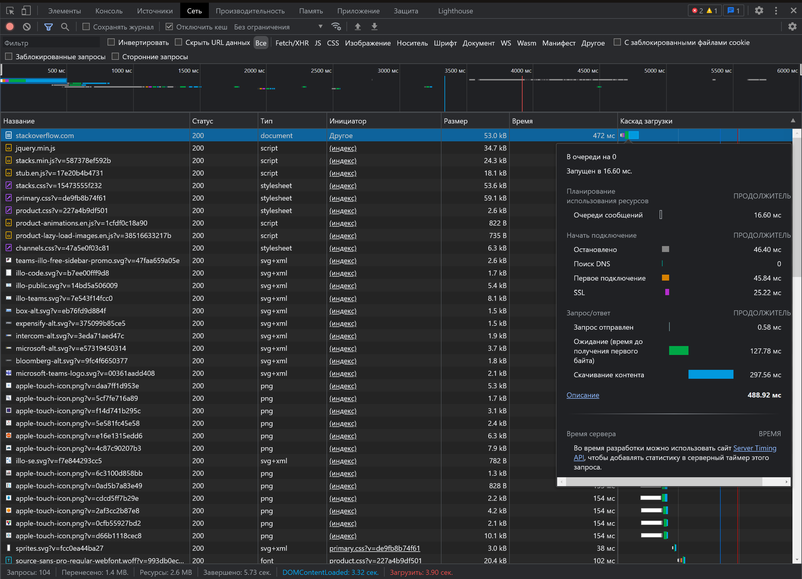

# devops-netology

---

### Домашнее задание к занятию "3.6. Компьютерные сети, лекция 1"

1. #### Работа c HTTP через телнет.
- Подключитесь утилитой телнет к сайту stackoverflow.com
`telnet stackoverflow.com 80`
- отправьте HTTP запрос
```bash
GET /questions HTTP/1.0
HOST: stackoverflow.com
[press enter]
[press enter]
```
- В ответе укажите полученный HTTP код, что он означает?

```bash
  $ telnet stackoverflow.com 80
Trying 151.101.193.69...
Connected to stackoverflow.com.
Escape character is '^]'.
GET /questions HTTP/1.0
HOST: stackoverflow.com

HTTP/1.1 301 Moved Permanently
cache-control: no-cache, no-store, must-revalidate
location: https://stackoverflow.com/questions
x-request-guid: 41698738-3ff9-4447-8ea6-3ad4f5cf7571
feature-policy: microphone 'none'; speaker 'none'
content-security-policy: upgrade-insecure-requests; frame-ancestors 'self' https://stackexchange.com
Accept-Ranges: bytes
Date: Sat, 11 Dec 2021 15:06:53 GMT
Via: 1.1 varnish
Connection: close
X-Served-By: cache-bma1625-BMA
X-Cache: MISS
X-Cache-Hits: 0
X-Timer: S1639235213.418182,VS0,VE101
Vary: Fastly-SSL
X-DNS-Prefetch-Control: off
Set-Cookie: prov=2e8fc8cc-a2bb-8d73-fa4c-70c6e9d08a4d; domain=.stackoverflow.com; expires=Fri, 01-Jan-2055 00:00:00 GMT; path=/; HttpOnly

Connection closed by foreign host.
```

2. #### Повторите задание 1 в браузере, используя консоль разработчика F12.
- откройте вкладку `Network`
- отправьте запрос http://stackoverflow.com
- найдите первый ответ HTTP сервера, откройте вкладку `Headers`
- укажите в ответе полученный HTTP код.

```html
Request URL: https://stackoverflow.com/
Request Method: GET
Status Code: 200 
Remote Address: 151.101.129.69:443
Referrer Policy: strict-origin-when-cross-origin
accept-ranges: bytes
cache-control: private
content-encoding: gzip
content-security-policy: upgrade-insecure-requests; frame-ancestors 'self' https://stackexchange.com
content-type: text/html; charset=utf-8
date: Sat, 11 Dec 2021 15:14:15 GMT
feature-policy: microphone 'none'; speaker 'none'
strict-transport-security: max-age=15552000
vary: Accept-Encoding,Fastly-SSL
via: 1.1 varnish
x-cache: MISS
x-cache-hits: 0
x-dns-prefetch-control: off
x-frame-options: SAMEORIGIN
x-request-guid: cf9849a0-e846-49af-a28b-e2be60063ca0
x-served-by: cache-bma1677-BMA
x-timer: S1639235656.732095,VS0,VE105
:authority: stackoverflow.com
:method: GET
:path: /
:scheme: https
accept: text/html,application/xhtml+xml,application/xml;q=0.9,image/avif,image/webp,image/apng,*/*;q=0.8,application/signed-exchange;v=b3;q=0.9
accept-encoding: gzip, deflate, br
accept-language: ru-RU,ru;q=0.9,en-US;q=0.8,en;q=0.7
cache-control: max-age=0
cookie: prov=9e76e53e-f463-32d1-915f-abc1a6aa53d0; OptanonAlertBoxClosed=2021-11-01T15:27:49.501Z; OptanonConsent=isIABGlobal=false&datestamp=Mon+Nov+01+2021+18%3A27%3A49+GMT%2B0300+(%D0%9C%D0%BE%D1%81%D0%BA%D0%B2%D0%B0%2C+%D1%81%D1%82%D0%B0%D0%BD%D0%B4%D0%B0%D1%80%D1%82%D0%BD%D0%BE%D0%B5+%D0%B2%D1%80%D0%B5%D0%BC%D1%8F)&version=6.10.0&hosts=&landingPath=NotLandingPage&groups=C0003%3A1%2CC0004%3A1%2CC0002%3A1%2CC0001%3A1; _ym_uid=1635781312173046707; _ym_d=1635781312; mfnes=5437CAQQARoLCKTdvfbl0ps6EAUyCDY2ODY0NTI4
sec-ch-ua: "Opera GX";v="81", " Not;A Brand";v="99", "Chromium";v="95"
sec-ch-ua-mobile: ?0
sec-ch-ua-platform: "Windows"
sec-fetch-dest: document
sec-fetch-mode: navigate
sec-fetch-site: none
sec-fetch-user: ?1
upgrade-insecure-requests: 1
user-agent: Mozilla/5.0 (Windows NT 10.0; Win64; x64) AppleWebKit/537.36 (KHTML, like Gecko) Chrome/95.0.4638.69 Safari/537.36 OPR/81.0.4196.61 (Edition Yx GX)
```
- проверьте время загрузки страницы, какой запрос обрабатывался дольше всего?
    
  Дольше всего обрабатывался запрос открытия документа `stackoverflow.com 472ms`, 

- приложите скриншот консоли браузера в ответ.



3. #### Какой IP адрес у вас в интернете?

```bash
  $ wget -qO- ip.yandex.ru | grep -E -o "(25[0-5]|2[0-4][0-9]|[01]?[0-9][0-9]?)\.(25[0-5]|2[0-4][0-9]|[01]?[0-9][0-9]?)\.(25[0-5]|2[0-4][0-9]|[01]?[0-9][0-9]?)\.(25[0-5]|2[0-4][0-9]|[01]?[0-9][0-9]?)" | uniq
2.92.126.56
  $ dig TXT +short o-o.myaddr.l.google.com @ns1.google.com | awk -F'"' '{ print $2}'
2.92.126.56
```

4. #### Какому провайдеру принадлежит ваш IP адрес? Какой автономной системе AS? Воспользуйтесь утилитой `whois`

```bash
  $ whois -h whois.ripe.net 2.92.126.56 | grep -E "(netname|role|origin)"
netname:        BEELINE-BROADBAND
role:           CORBINA TELECOM Network Operations
origin:         AS3216
origin:         AS8402
```

5. #### Через какие сети проходит пакет, отправленный с вашего компьютера на адрес 8.8.8.8? Через какие AS? Воспользуйтесь утилитой `traceroute`

```bash
$ traceroute -An 8.8.8.8 | grep 'AS'
 6  85.21.93.129 [AS8402]  15.790 ms  4.963 ms *
 7  195.14.32.22 [AS8402]  5.173 ms 108.170.250.51 [AS15169]  5.830 ms *
 8  108.170.250.129 [AS15169]  6.926 ms * *
 9  108.170.250.33 [AS15169]  10.282 ms  9.782 ms 74.125.253.109 [AS15169]  21.740 ms
10  216.239.54.201 [AS15169]  24.258 ms 142.250.57.5 [AS15169]  24.704 ms 74.125.253.147 [AS15169]  24.253 ms
11  142.251.49.24 [AS15169]  24.453 ms * 142.250.239.64 [AS15169]  17.717 ms
12  108.170.232.251 [AS15169]  17.614 ms 216.239.57.229 [AS15169]  19.066 ms 216.239.63.27 [AS15169]  24.631 ms
13  * 216.239.63.27 [AS15169]  24.016 ms *
20  8.8.8.8 [AS15169]  26.075 ms *  24.435 ms
```

6. #### Повторите задание 5 в утилите `mtr`. На каком участке наибольшая задержка - delay?

```bash
  $ mtr -rzn -c 100 8.8.8.8
Start: 2021-12-11T20:34:46+0300
HOST: MyHost                      Loss%   Snt   Last   Avg  Best  Wrst StDev
  1. AS???    172.31.128.1         0.0%   100    0.9   1.9   0.8   2.9   0.4
  2. AS???    10.100.88.1          0.0%   100    4.0   4.3   2.1   6.5   0.9
  3. AS???    100.124.0.1          0.0%   100    6.7   5.9   3.2  15.5   1.6
  4. AS???    ???                 100.0   100    0.0   0.0   0.0   0.0   0.0
  5. AS???    ???                 100.0   100    0.0   0.0   0.0   0.0   0.0
  6. AS8402   85.21.224.191        0.0%   100    6.9  10.1   4.2  93.5   9.6
  7. AS15169  108.170.250.130      0.0%   100   15.1  10.3   7.3  35.7   2.9
  8. AS15169  209.85.255.136      31.0%   100   25.3  28.0  25.1  44.6   3.1
  9. AS15169  72.14.238.168        3.0%   100   35.6  35.0  21.8 111.8  15.9
 10. AS15169  72.14.236.73         0.0%   100   26.5  28.2  25.8  47.9   2.3
 11. AS???    ???                 100.0   100    0.0   0.0   0.0   0.0   0.0
 12. AS???    ???                 100.0   100    0.0   0.0   0.0   0.0   0.0
 13. AS???    ???                 100.0   100    0.0   0.0   0.0   0.0   0.0
 14. AS???    ???                 100.0   100    0.0   0.0   0.0   0.0   0.0
 15. AS???    ???                 100.0   100    0.0   0.0   0.0   0.0   0.0
 16. AS???    ???                 100.0   100    0.0   0.0   0.0   0.0   0.0
 17. AS???    ???                 100.0   100    0.0   0.0   0.0   0.0   0.0
 18. AS???    ???                 100.0   100    0.0   0.0   0.0   0.0   0.0
 19. AS???    ???                 100.0   100    0.0   0.0   0.0   0.0   0.0
 20. AS15169  8.8.8.8              0.0%   100   22.4  23.3  20.7  25.9   1.1
```
Наибольшая задержка наблюдается на узле 72.14.238.168 AS15169 delay avg=35.6

7. #### Какие DNS сервера отвечают за доменное имя dns.google? Какие A записи? воспользуйтесь утилитой `dig`

```bash
  $ dig +short NS @1.1.1.1 dns.google
ns1.zdns.google.
ns2.zdns.google.
ns3.zdns.google.
ns4.zdns.google.
  $ dig +short A @1.1.1.1 dns.google
8.8.8.8
8.8.4.4
```

8. #### Проверьте PTR записи для IP адресов из задания 7. Какое доменное имя привязано к IP? воспользуйтесь утилитой `dig`

```bash
  $ dig +noall +answer @1.1.1.1 -x 8.8.8.8
8.8.8.8.in-addr.arpa.   77970   IN      PTR     dns.google.
  $ dig +noall +answer @1.1.1.1 -x 8.8.4.4
4.4.8.8.in-addr.arpa.   79375   IN      PTR     dns.google.
```
 
---
