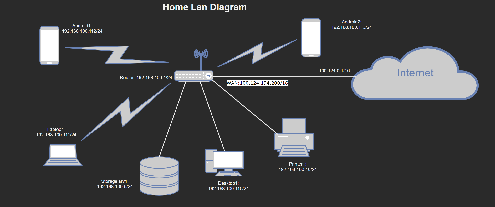

# devops-netology

---

### Домашнее задание к занятию "3.8. Компьютерные сети, лекция 3"

1. #### Подключитесь к публичному маршрутизатору в интернет. Найдите маршрут к вашему публичному IP

```
telnet route-views.routeviews.org
Username: rviews
show ip route x.x.x.x/32
show bgp x.x.x.x/32
```

````
route-views>show ip route 94.228.244.150
Routing entry for 94.228.244.0/24
  Known via "bgp 6447", distance 20, metric 0
  Tag 6939, type external
  Last update from 64.71.137.241 1d00h ago
  Routing Descriptor Blocks:
  * 64.71.137.241, from 64.71.137.241, 1d00h ago
      Route metric is 0, traffic share count is 1
      AS Hops 2
      Route tag 6939
      MPLS label: none
route-views>show bgp 94.228.244.150
BGP routing table entry for 94.228.244.0/24, version 1838922523
Paths: (4 available, best #4, table default)
  Not advertised to any peer
  Refresh Epoch 3
  3303 6939 15672
    217.192.89.50 from 217.192.89.50 (138.187.128.158)
      Origin IGP, localpref 100, valid, external
      Community: 3303:1006 3303:1021 3303:1030 3303:3067 6939:7154 6939:8233 6939:9002
      path 7FE1084586A0 RPKI State not found
      rx pathid: 0, tx pathid: 0
  Refresh Epoch 1
  1351 6939 15672
    132.198.255.253 from 132.198.255.253 (132.198.255.253)
      Origin IGP, localpref 100, valid, external
      path 7FE1029EA1D8 RPKI State not found
      rx pathid: 0, tx pathid: 0
  Refresh Epoch 1
  20130 6939 15672
    140.192.8.16 from 140.192.8.16 (140.192.8.16)
      Origin IGP, localpref 100, valid, external
      path 7FE0E1F66B50 RPKI State not found
      rx pathid: 0, tx pathid: 0
  Refresh Epoch 1
  6939 15672
    64.71.137.241 from 64.71.137.241 (216.218.252.164)
      Origin IGP, localpref 100, valid, external, best
      unknown transitive attribute: flag 0xE0 type 0x20 length 0xC
        value 0000 21B7 0000 0777 0000 21B7
      path 7FE0DD864D48 RPKI State not found
      rx pathid: 0, tx pathid: 0x0
````

2. #### Создайте dummy0 интерфейс в Ubuntu. Добавьте несколько статических маршрутов. Проверьте таблицу маршрутизации.

```bash
  $ sudo ip link add dummy0 type dummy
  $ sudo ip link set up dummy0
  $ sudo ip address add 10.12.12.1/32 dev dummy0
  $ sudo ip -c -br a
lo               UNKNOWN        127.0.0.1/8 ::1/128
bond0            DOWN
eth0             UP             172.31.56.66/20 fe80::215:5dff:fecd:77fc/64
dummy0           UNKNOWN        10.12.12.1/32 fe80::54e8:12ff:fefa:b168/64
  $ sudo ip route add 172.16.220.0/24 via 172.31.56.10
  $ sudo ip route add 10.100.77.0/29 via 172.31.56.100
  $ sudo ip -c route
default via 172.31.48.1 dev eth0
10.100.77.0/29 via 172.31.56.100 dev eth0
172.16.220.0/24 via 172.31.56.10 dev eth0
172.31.48.0/20 dev eth0 proto kernel scope link src 172.31.56.66
217.69.139.200 dev dummy0 scope link
```

3. #### Проверьте открытые TCP порты в Ubuntu, какие протоколы и приложения используют эти порты? Приведите несколько примеров.

```bash
  $ sudo ss -tnlp
State               Recv-Q              Send-Q                           Local Address:Port                              Peer Address:Port                                                                       
LISTEN              0                   20                                   127.0.0.1:25                                     0.0.0.0:*                  users:(("exim4",pid=4411,fd=3))                         
LISTEN              0                   128                                  127.0.0.1:953                                    0.0.0.0:*                  users:(("named",pid=813,fd=24))                                                
LISTEN              0                   3                                    127.0.0.1:2601                                   0.0.0.0:*                  users:(("zebra",pid=666,fd=10))                         
LISTEN              0                   3                                    127.0.0.1:2602                                   0.0.0.0:*                  users:(("ripd",pid=25609,fd=6))                         
LISTEN              0                   5                                      0.0.0.0:973                                    0.0.0.0:*                  users:(("rsync",pid=786,fd=4))                                                                 
LISTEN              0                   10                               172.16.22.253:53                                     0.0.0.0:*                  users:(("named",pid=813,fd=22))                         
LISTEN              0                   10                                   127.0.0.1:53                                     0.0.0.0:*                  users:(("named",pid=813,fd=21))                         
LISTEN              0                   128                                    0.0.0.0:22                                     0.0.0.0:*                  users:(("sshd",pid=1098,fd=3))                          
LISTEN              0                   20                                       [::1]:25                                        [::]:*                  users:(("exim4",pid=4411,fd=4))                         
LISTEN              0                   128                                      [::1]:953                                       [::]:*                  users:(("named",pid=813,fd=25))                                          
LISTEN              0                   5                                         [::]:973                                       [::]:*                  users:(("rsync",pid=786,fd=5))                          
LISTEN              0                   10                                       [::1]:53                                        [::]:*                  users:(("named",pid=813,fd=23))                         
LISTEN              0                   128                                       [::]:22                                        [::]:*                  users:(("sshd",pid=1098,fd=4))         
```

Порт 53 использует приложение bind9 - локальный DNS сервер:

```bash
  $ sudo lsof -i TCP:53
COMMAND PID USER   FD   TYPE DEVICE SIZE/OFF NODE NAME
named   813 bind   21u  IPv4  22492      0t0  TCP localhost:domain (LISTEN)
named   813 bind   22u  IPv4  22494      0t0  TCP 172.16.22.253:domain (LISTEN)
named   813 bind   23u  IPv6  22496      0t0  TCP localhost:domain (LISTEN)
```

Порт 25 использует приложение exim - локальный SMTP сервер:

```bash
  $ sudo lsof -i TCP:25
COMMAND  PID        USER   FD   TYPE DEVICE SIZE/OFF NODE NAME
exim4   4411 Debian-exim    3u  IPv4  28829      0t0  TCP localhost:smtp (LISTEN)
exim4   4411 Debian-exim    4u  IPv6  28830      0t0  TCP localhost:smtp (LISTEN)
```

4. #### Проверьте используемые UDP сокеты в Ubuntu, какие протоколы и приложения используют эти порты?

```bash
  $ sudo ss -unap
State          Recv-Q         Send-Q                  Local Address:Port                   Peer Address:Port                                                                                                     
UNCONN         0              0                       172.16.22.253:53                          0.0.0.0:*             users:(("named",pid=813,fd=517),("named",pid=813,fd=516),("named",pid=813,fd=515))         
UNCONN         0              0                           127.0.0.1:53                          0.0.0.0:*             users:(("named",pid=813,fd=514),("named",pid=813,fd=513),("named",pid=813,fd=512))         
UNCONN         0              0                             0.0.0.0:520                         0.0.0.0:*             users:(("ripd",pid=25609,fd=7))                                                                                                                        
UNCONN         0              0                               [::1]:53                             [::]:*             users:(("named",pid=813,fd=520),("named",pid=813,fd=519),("named",pid=813,fd=518))     
```

* 53 - порт DNS сервера bind;
* 520 - порт, протокол динамической маршрутизации rip, демон ripd. 

6. #### Используя diagrams.net, создайте L3 диаграмму вашей домашней сети или любой другой сети, с которой вы работали. 



 ---
