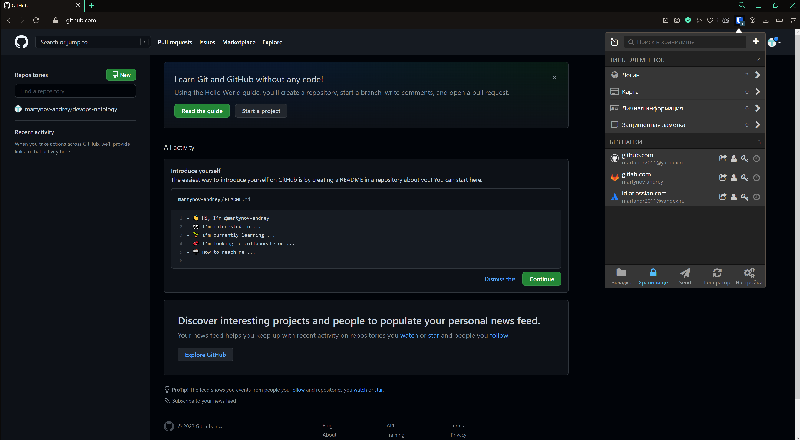
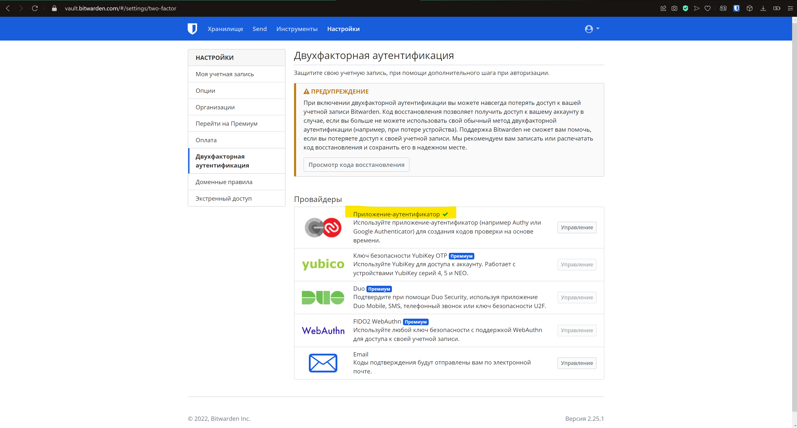
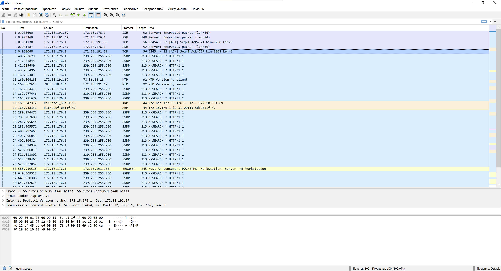

# devops-netology

---

### Домашнее задание к занятию "3.9. Элементы безопасности информационных систем"

#### 1. Установите Bitwarden плагин для браузера. Зарегестрируйтесь и сохраните несколько паролей.



#### 2.Установите Google authenticator на мобильный телефон. Настройте вход в Bitwarden акаунт через Google authenticator OTP.



#### 3.Установите apache2, сгенерируйте самоподписанный сертификат, настройте тестовый сайт для работы по HTTPS.

```bash
  $ cat /etc/apache2/sites-enabled/test.conf
<IfModule mod_ssl.c>
<VirtualHost *:443>
   ServerName example.com
   DocumentRoot /var/www/test
   SSLEngine on
   SSLCertificateFile /etc/ssl/certs/apache-selfsigned.crt
   SSLCertificateKeyFile /etc/ssl/private/apache-selfsigned.key
</VirtualHost>
</IfModule>
  $ openssl x509 -text -noout -in  /etc/ssl/certs/apache-selfsigned.crt | head -n 11
Certificate:
    Data:
        Version: 3 (0x2)
        Serial Number:
            64:78:43:52:89:e8:b6:2e:54:34:bb:cf:5d:e5:cb:b5:11:d2:7a:e0
        Signature Algorithm: sha256WithRSAEncryption
        Issuer: C = RU, ST = Moscow, L = Moscow, O = Company Name, OU = Org, CN = www.example.com
        Validity
            Not Before: Jan 10 10:47:52 2022 GMT
            Not After : Jan 10 10:47:52 2023 GMT
        Subject: C = RU, ST = Moscow, L = Moscow, O = Company Name, OU = Org, CN = www.example.com
  $ curl -k https://localhost/
<h1>Hi! It worked!</h1>        
```

#### 4. Проверьте на TLS уязвимости произвольный сайт в интернете (кроме сайтов МВД, ФСБ, МинОбр, НацБанк, РосКосмос, РосАтом, РосНАНО и любых госкомпаний, объектов КИИ, ВПК ... и тому подобное).

```bash
    $ ./testssl.sh -U --sneaky https://habr.com


###########################################################
    testssl.sh       3.1dev from https://testssl.sh/dev/
    (35ddd91 2021-12-21 10:54:58 -- )

      This program is free software. Distribution and
             modification under GPLv2 permitted.
      USAGE w/o ANY WARRANTY. USE IT AT YOUR OWN RISK!

       Please file bugs @ https://testssl.sh/bugs/

###########################################################

 Using "OpenSSL 1.1.1f  31 Mar 2020" [~98 ciphers]
 on PocketPC:/usr/bin/openssl
 (built: "Nov 24 13:20:48 2021", platform: "debian-amd64")


Testing all IPv4 addresses (port 443): 178.248.237.68 192.5.6.30 192.33.14.30 192.26.92.30 192.31.80.30 192.12.94.30 192.35.51.30 192.42.93.30 192.54.112.30 192.43.172.30 192.48.79.30 192.52.178.30 192.41.162.30 192.55.83.30
------------------------------------------------------------------------------------------------------------------------------------------
 Start 2022-01-10 15:15:24        -->> 178.248.237.68:443 (habr.com) <<--

 Further IP addresses:   192.5.6.30 192.33.14.30 192.26.92.30 192.31.80.30 192.12.94.30 192.35.51.30 192.42.93.30 192.54.112.30 192.43.172.30 192.48.79.30 192.52.178.30 192.41.162.30 192.55.83.30
 rDNS (178.248.237.68):  --
 Service detected:       HTTP


 Testing vulnerabilities

 Heartbleed (CVE-2014-0160)                not vulnerable (OK), no heartbeat extension
 CCS (CVE-2014-0224)                       not vulnerable (OK)
 Ticketbleed (CVE-2016-9244), experiment.  not vulnerable (OK)
 ROBOT                                     not vulnerable (OK)
 Secure Renegotiation (RFC 5746)           supported (OK)
 Secure Client-Initiated Renegotiation     not vulnerable (OK)
 CRIME, TLS (CVE-2012-4929)                not vulnerable (OK)
 BREACH (CVE-2013-3587)                    no gzip/deflate/compress/br HTTP compression (OK)  - only supplied "/" tested
 POODLE, SSL (CVE-2014-3566)               not vulnerable (OK)
 TLS_FALLBACK_SCSV (RFC 7507)              No fallback possible (OK), no protocol below TLS 1.2 offered
 SWEET32 (CVE-2016-2183, CVE-2016-6329)    VULNERABLE, uses 64 bit block ciphers
 FREAK (CVE-2015-0204)                     not vulnerable (OK)
 DROWN (CVE-2016-0800, CVE-2016-0703)      not vulnerable on this host and port (OK)
                                           make sure you don't use this certificate elsewhere with SSLv2 enabled services
                                           https://censys.io/ipv4?q=23C599AB56B3C8DD6984AFE74F7BE26C88B8EDFD9C47F3B97808D9CFF159C8C4 could help you to find out
 LOGJAM (CVE-2015-4000), experimental      not vulnerable (OK): no DH EXPORT ciphers, no DH key detected with <= TLS 1.2
 BEAST (CVE-2011-3389)                     not vulnerable (OK), no SSL3 or TLS1
 LUCKY13 (CVE-2013-0169), experimental     potentially VULNERABLE, uses cipher block chaining (CBC) ciphers with TLS. Check patches
 Winshock (CVE-2014-6321), experimental    not vulnerable (OK)
 RC4 (CVE-2013-2566, CVE-2015-2808)        no RC4 ciphers detected (OK)


 Done 2022-01-10 15:16:15 [  60s] -->> 178.248.237.68:443 (habr.com) <<--
```

#### 5. Установите на Ubuntu ssh сервер, сгенерируйте новый приватный ключ. Скопируйте свой публичный ключ на другой сервер. Подключитесь к серверу по SSH-ключу.

```bash
  $ ssh-keygen
Generating public/private rsa key pair.
Enter file in which to save the key (/home/vagrant/.ssh/id_rsa): /home/vagrant/.ssh/new_rsa
.....
  $ ssh-copy-id -i .ssh/new_rsa vagrant@172.18.185.223
/usr/bin/ssh-copy-id: INFO: Source of key(s) to be installed: ".ssh/new_rsa.pub"
The authenticity of host '172.18.185.223 (172.18.185.223)' can't be established.
ECDSA key fingerprint is SHA256:m/VIsiogMCq1p7qRYnvA8FFGuwjwXmMd4rMKEuuOgaY.
Are you sure you want to continue connecting (yes/no/[fingerprint])? YES
/usr/bin/ssh-copy-id: INFO: attempting to log in with the new key(s), to filter out any that are already installed
/usr/bin/ssh-copy-id: INFO: 1 key(s) remain to be installed -- if you are prompted now it is to install the new keys
vagrant@172.18.185.223's password:

Number of key(s) added: 1

Now try logging into the machine, with:   "ssh 'vagrant@172.18.185.223'"
and check to make sure that only the key(s) you wanted were added.
  $ ssh -i .ssh/new_rsa vagrant@172.18.185.223
Last login: Mon Jan 10 12:57:09 2022 from 172.18.176.1
```
 
#### 6. Переименуйте файлы ключей из задания 5. Настройте файл конфигурации SSH клиента, так чтобы вход на удаленный сервер осуществлялся по имени сервера.

```bash
  $ mv .ssh/new_rsa .ssh/id_new_rsa
  $ mv .ssh/new_rsa.pub .ssh/id_new_rsa.pub
  $ cat .ssh/config
Host debian
    Hostname 172.18.185.223
    User vagrant
    IdentityFile ~/.ssh/id_new_rsa
  $ ssh debian 'cat ~/.ssh/authorized_keys'
ssh-rsa AAAAB3NzaC1yc2EAAAADAQABAAABgQCnqLTo5eMaliJQNy2lZ8M5L/sGIIMmzJ5lTDnsjCNOjH/KZt+j+bRstm9uSRLeEQ9eQM4Zkt6miIIu31ojLyxF2oYure2A/ByGIRTSp2bcntoWhqkaSPUY6LFD19eTNj9/mfOci1Biz/X9nbDOjXnS14mMyoxPftAP9wk2Nn45x7Do9cc94COPmESnoOddsESYk/soDp1f3q6jiliXdnUqeRkyrvTwK9yb1gdMTbljeUNcsXLg7XnmI0z67FoUljp9Z5f22L6CCulILix1dH1koQ/NEVFalmYYtXwWj0OANVf60cZEMDVv8klfOiWWKGJXkcWk4+Cv27YOc+vGVmvKegAA0AE6ViEQq6KDKMj8dHs74Cq7SB0fu0o0zjKPMc5y8Z6fJyZf40Z2Fqd3f1fxnnztgK7Z2vzJUA6RsIPYNi5zb0cPdUvUGwpwTF5UFVekdH2FM8dbsXEz5SNhyRaQtPIo3FpIXj/0VYl8FCYO5ijMUUR7emaHRRGXgz4l3Uk= vagrant@ubuntu-20
```

#### 7. Соберите дамп трафика утилитой tcpdump в формате pcap, 100 пакетов. Откройте файл pcap в Wireshark.

```bash
  $ sudo tcpdump -nnei any -c 100 -w ubuntu.pcap
tcpdump: listening on any, link-type LINUX_SLL (Linux cooked v1), capture size 262144 bytes
100 packets captured
102 packets received by filter
0 packets dropped by kernel
```



---
